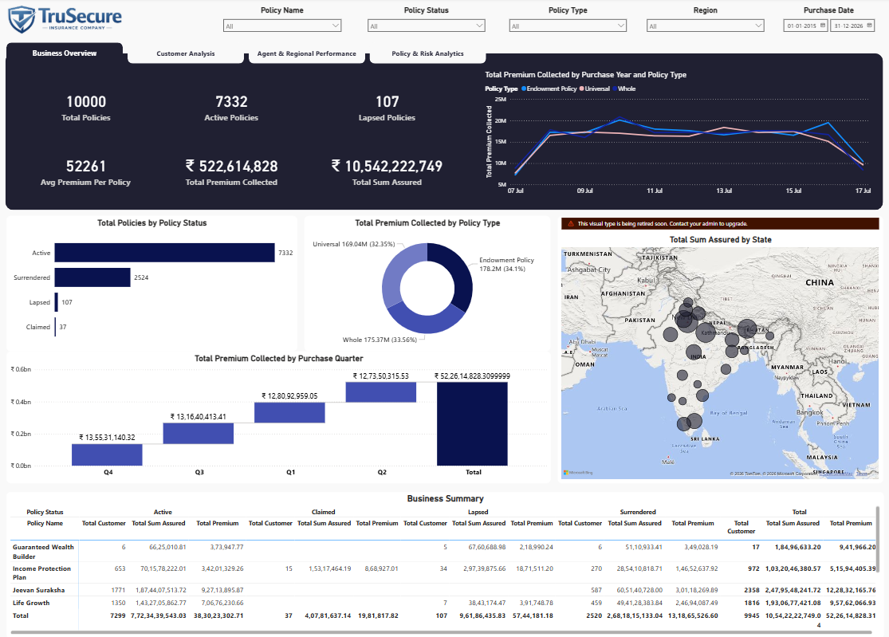
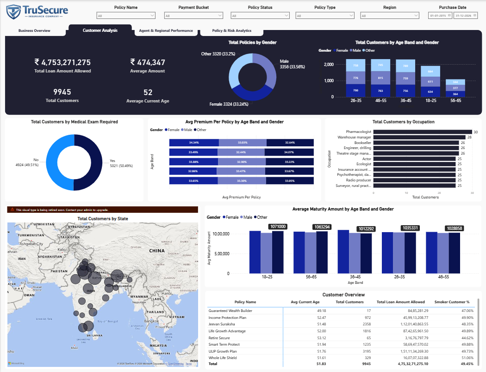
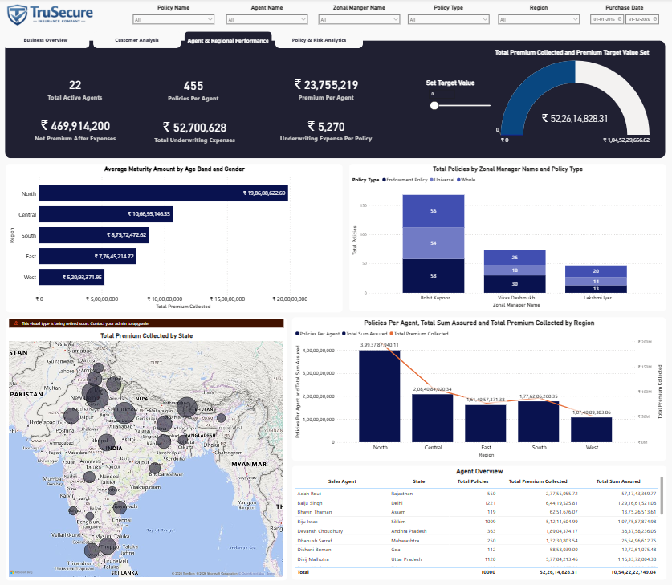
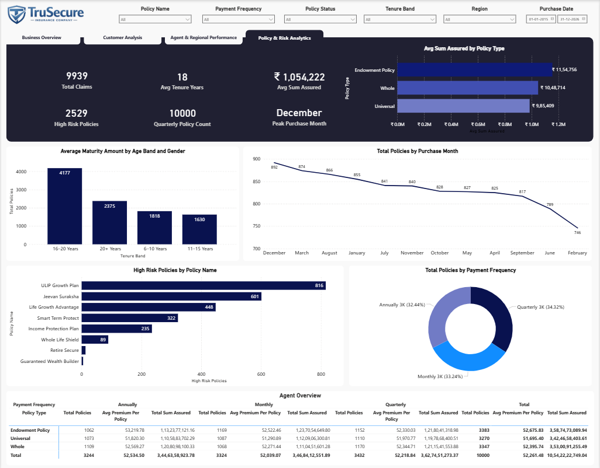

# TruSecure-Insurance-PBI-Dashboard
A simulated insightful dashboard for a insurance company named TruSecure.  

A 4-page interactive Power BI dashboard built on insurance policy data covering
10,000 policies across agents, regions, customers, and risk profiles.

---

## 📊 Dashboard Pages

### Page 1 — Business Overview

The executive summary page. Designed for C-suite and management to get a
bird's-eye view of the entire portfolio at a glance.

**Key Visuals:**
- **KPI Cards** — Total Policies, Active Policies, Lapsed Policies, Avg Premium
  Per Policy, Total Premium Collected, Total Sum Assured
- **Line Chart** — Total Premium Collected by Purchase Year broken down by
  Policy Type (Endowment, Universal, Whole) to track revenue trends over time
- **Bar Chart** — Total Policies by Policy Status (Active, Surrendered, Lapsed,
  Claimed) showing portfolio health distribution
- **Donut Chart** — Total Premium Collected by Policy Type showing revenue share
  across Endowment, Universal, and Whole Life policies
- **Waterfall Chart** — Total Premium Collected by Purchase Quarter showing
  quarter-on-quarter growth and decline patterns
- **Bubble Map** — Total Sum Assured by State giving a geographic view of
  coverage concentration across India
- **Summary Table** — Business Summary matrix breaking down Total Customers,
  Total Sum Assured, and Total Premium by Policy Name and Policy Status
  (Active, Claimed, Lapsed, Surrendered)

**Slicers:** Policy Name · Policy Status · Policy Type · Region · Purchase Date

---

### Page 2 — Customer Analysis

Deep-dive into who the customers are — demographics, risk profile, loan
behaviour, and maturity value by segment.

**Key Visuals:**
- **KPI Cards** — Total Loan Amount Allowed, Average Amount, Total Customers,
  Average Current Age
- **Donut Chart** — Total Policies by Gender (Male / Female / Other) showing
  customer gender distribution
- **Clustered Bar Chart** — Total Customers by Age Band and Gender showing
  which age groups dominate the portfolio and how gender splits within each band
- **Donut Chart** — Total Customers by Medical Exam Required (Yes/No) giving
  a quick read on underwriting complexity
- **Heatmap Matrix** — Avg Premium Per Policy by Age Band and Gender revealing
  which demographic segments pay the most premium on average
- **Horizontal Bar Chart** — Total Customers by Occupation identifying the
  top professions among policyholders
- **Bubble Map** — Total Customers by State showing geographic customer
  concentration across India
- **Column Chart** — Average Maturity Amount by Age Band and Gender helping
  identify which customer segments yield the highest maturity payout
- **Summary Table** — Customer Overview showing Avg Current Age, Total
  Customers, Total Loan Amount Allowed, and Smoker Customer % per Policy Name

**Slicers:** Policy Name · Payment Bucket · Policy Status · Policy Type ·
Region · Purchase Date

---

### Page 3 — Agent & Regional Performance

Sales performance page for Sales Heads and Regional Managers to evaluate
agent productivity and regional revenue contribution.

**Key Visuals:**
- **KPI Cards** — Total Active Agents, Policies Per Agent, Premium Per Agent,
  Net Premium After Expenses, Total Underwriting Expenses, Underwriting
  Expense Per Policy
- **Gauge Chart** — Total Premium Collected vs target showing attainment at
  a glance
- **Horizontal Bar Chart** — Total Premium Collected by Region (North, Central,
  South, East, West) ranking regions by revenue contribution
- **Stacked Column Chart** — Total Policies by Zonal Manager Name and Policy
  Type showing each zonal manager's portfolio mix across policy types
- **Bubble Map** — Total Premium Collected by State for granular geographic
  revenue visibility
- **Line + Column Combo Chart** — Policies Per Agent, Total Sum Assured, and
  Total Premium Collected by Region on a dual axis for multi-metric regional
  comparison
- **Agent Overview Table** — Sales Agent, State, Total Policies, Total Premium
  Collected, Total Sum Assured — the agent leaderboard sortable by any column

**Slicers:** Policy Name · Agent Name · Zonal Manager Name · Policy Type ·
Region · Purchase Date

---

### Page 4 — Policy & Risk Analytics

Underwriting and risk page for actuarial and product teams to analyse policy
structure, payment behaviour, tenure concentration, and risk exposure.

**Key Visuals:**
- **KPI Cards** — Total Claims, Avg Tenure Years, Avg Sum Assured, High Risk
  Policies, Quarterly Policy Count, Peak Purchase Month
- **Horizontal Bar Chart** — Avg Sum Assured by Policy Type comparing coverage
  levels across Endowment, Whole, and Universal policies
- **Column Chart** — Average Maturity Amount by Tenure Band showing how
  maturity payout grows with longer tenure commitments
- **Line Chart** — Total Policies by Purchase Month revealing seasonality
  patterns in policy purchases across the year
- **Horizontal Bar Chart** — High Risk Policies by Policy Name identifying
  which products carry the most risk concentration
- **Donut Chart** — Total Policies by Payment Frequency (Monthly, Quarterly,
  Annually) showing cash flow pattern of the portfolio
- **Matrix Table** — Agent Overview breaking down Total Policies, Avg Premium
  Per Policy, and Total Sum Assured by Policy Type × Payment Frequency
  (Annually, Monthly, Quarterly) with grand totals

**Slicers:** Policy Name · Payment Frequency · Policy Status · Tenure Band ·
Region · Purchase Date

---

## 🗂️ Data Model

Star schema with 1 Fact table and 6 Dimension tables.
